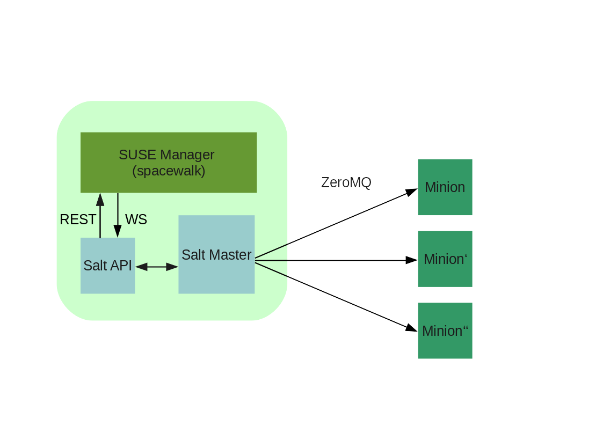

% SUSE Manager 3 Setup
% Marc Stulz
% November 08, 2016

# SUSE Manager 3 - Setup


---

## Agenda

* Functions

* Components

* Architecture

* Requirements

* Installation

* SCC / SMT

* Synchronisation

---

## Functions

* Provisioning

* Packages Management

* Patch Management

* Configuration Management

## Components

* Spacewalk / API

* Cobbler

* Postgres DB

* Apache Webserver

* Proxy

* SaltStack / API

## SaltStack



## Architecture


---

## Requirements

* Supscriptions

* Internet Access / SMT

* OS Version

* Hardware

* File system

* DNS / NTP

* Firewall rules

## Supported Clients

* Salt

    * SLES11 SP3 =<

* Traditional

    * SLES10 SP3 =<

    * RHEL5 =<

    * Novel Open Server 11 =<

---

## Registration

[scc.suse.com](https://scc.suse.com)

```text
# SUSEConnect -e "$mail_address" -r "$registration_code"

# SUSEConnect -p SUSE-Manager-Server/3.0/x86_64 -r "$registration_code"
```

If your SUMA system doesn't have access to SCC, use your internal SMT server.

## Installation

Available as pattern

```text
# zypper install -t pattern suma_server
```

## Yast Wizar

* E-mail address for notifications

* Cert setup

* Database crediantials

* SCC settings

```text
# yast2 susemanager_setup
```

## Create Organization

* Define Organization Name

* Create User

---

## Hands-on :: Setup 01

