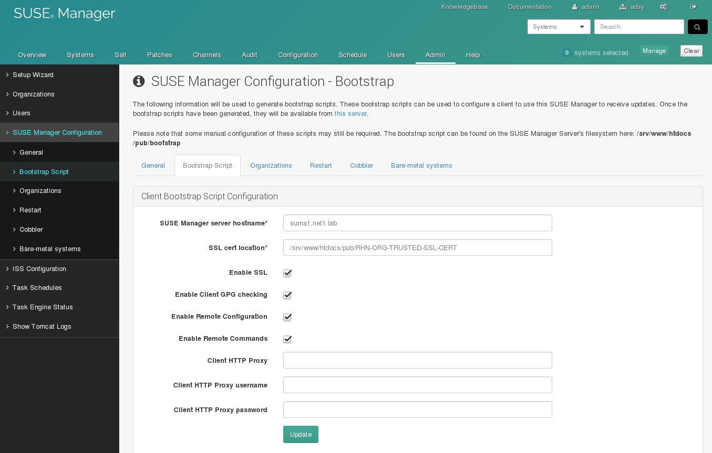
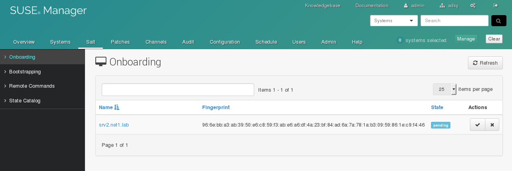

% SUSE Manager Client Registration
% Marc Stulz
% November 10, 2016

# SUSE Manager 3 Hands-on


---

## Hands-on :: Client Registration 04

Register systems with the traditional agent and as salt minion.

---

## Client Registration 04 - Repository

Create a bootstrap repository:

```text
# mgr-create-bootstrap-repo -l

# mgr-create-bootstrap-repo -c SLE-12-SP1-x86_64

# ls -la /srv/www/htdocs/pub/
```

---

## Client Registration 04 - Traditional

Generate a bootstrap script:



## Client Registration 04 - Traditional

Verify if the script exists:

```text
# ls -la /srv/www/htdocs/pub/bootstrap
```

## Client Registration 04 - Traditional

Copy the bootstrap script:

```text
# cd /srv/www/htdocs/pub/bootstrap

# cp bootstrap{,-prod}.sh
```

## Client Registration 04 - Traditional

Modify the bootstrap script:

`bootstrap-prod.sh`
```text
[...]
 74 #exit 1
 75 
 76 # can be edited, but probably correct (unless created during initial install):
 77 # NOTE: ACTIVATION_KEYS *must* be used to bootstrap a client machine.
 78 ACTIVATION_KEYS=1-ak-sles12sp1-prod-trad
```

## Client Registration 04 - Traditional

Connecting the first client to SUMA:

```text
# cd /srv/www/htdocs/pub/bootstrap/

# cat bootstrap-prod.sh | ssh root@srv1.net"$NR".lab /bin/bash
```

---

## Client Registration 04 - SaltStack

Add the SUMA tools repository and install the salt minion on srv2:

```text
# zypper addrepo \ 
         http://suma"$NR".net"$NR".lab/pub/repositories/sle/12/1/bootstrap/ \ 
         SUMA3-Tools

# zypper -n install salt-minion
```

## Client Registration 04 - SaltStack

Configure the minion and do a restart:

```text
# echo "master: suma"$NR".net"$NR".lab" > /etc/salt/minion.d/master.conf

# echo -e "susemanager:\n  activation_key: 1-ak-sles12sp1-devl-salt" \
          > /etc/salt/grains

# systemctl restart salt-minion
```

## Client Registration 04 - Salt Keys

List keys and accept the new minion:

```text
# salt-key -L

# salt-key -a srv2.net"$NR".lab
```

## Client Registration 04 - Salt Keys

Key management in the WebUI:



---

## Client Registration 04 - List Systems

List the new registred systems:

```text
# spacecmd system_list

# spacecmd system_details "$hostname"
```

## Client Registration 04 - List Systems


## Client Registration 04 - List Systems

Verfiy the repositoies on the new registered systems:

```text
# zypper repos
```

