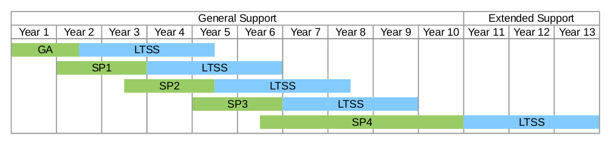

% SUSE Manager 3 SP Migration
% Marc Stulz
% November 18, 2016

# SUSE Manager 3 - SP Migration

---

## Agenda

* Overview

* Life-Cycle

* Features

---

## Overview

SUSE release Service Packs at regular intervals:

* Support for new hardware

* More receten versions of included packages

    * Better performance

    * Newer features

    * Bug fixes

* Product enhhancements

## Lifecycle

## Features

* Automated process to deploy service packs

* Provides 'Dry Run' function

* Migration can be scheduled for out of office hours

* Consecutive SP migration only

* Extensions can be migrated at the same time

---

## Hands-on :: SP Migrtation 09
