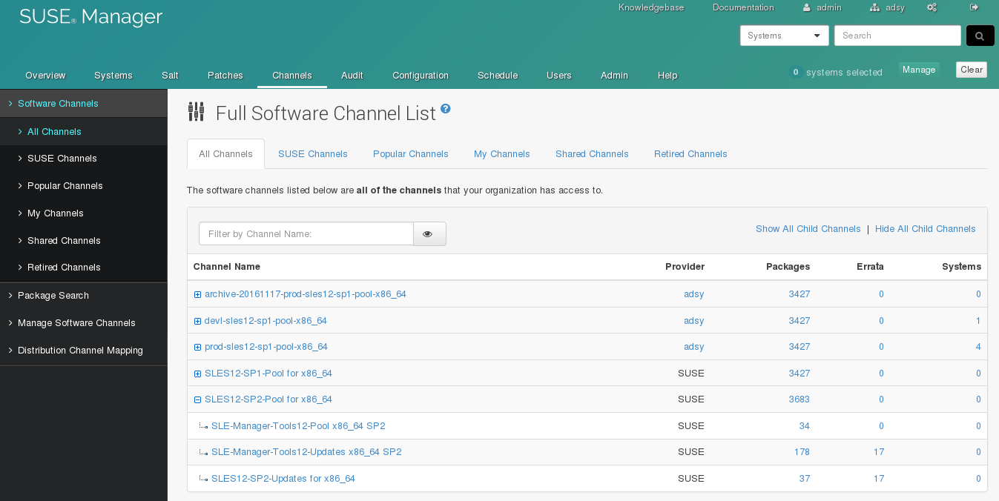
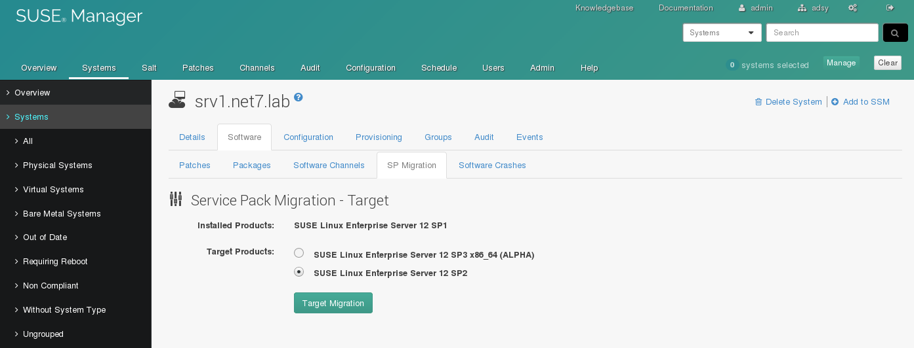
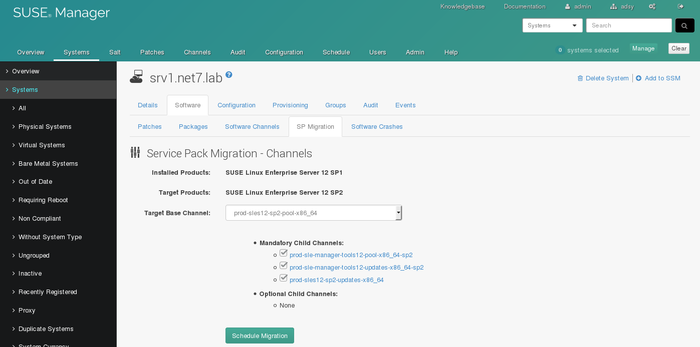
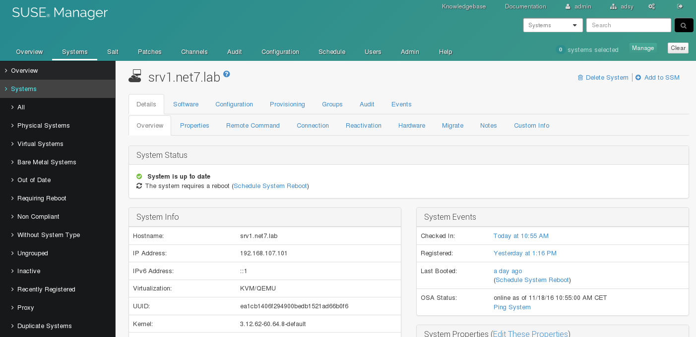
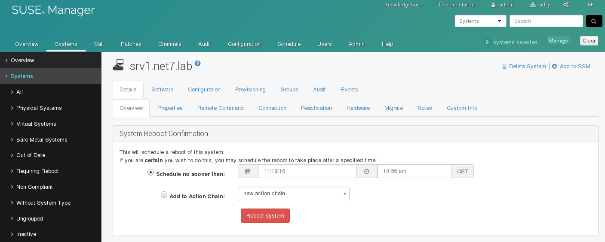

% SUSE Manager SP Migration
% Marc Stulz
% November 18, 2016

# SUSE Manager 3 Hands-on


---

## Hands-on :: SP Migration 09

Synchronize SP2 repositories and migrate a system.

---

## SP Migration 09 - Import

Configure the new repository data.

Stop the tomcat service:

```text
# systemctl stop tomcat
```

Change the data directory in `/etc/rhn/rhn.conf` to:

```text
# local data directory
server.susemanager.fromdir = /data/repos_wSP2_20161116
```

Start the tomcat service:

```text
# systemctl start tomcat
```

## SP Migration 09 - Synchronization

Refresh the channel and schedule a reposyn:

```text
# mgr-sync refresh 

# mgr-sync list channel 

# mgr-sync add channel sles12-sp2-pool-x86_64 

# mgr-sync add channel sles12-sp2-updates-x86_64 

# mgr-sync add channel sle-manager-tools12-pool-x86_64-sp2 

# mgr-sync add channel sle-manager-tools12-updates-x86_64-sp2 
```

Verify the synchronization:

```text
# ls -la /var/log/rhn/reposync/*sp2*
```

## SP Migration 09 - Vendor Channel

Check the SLES12 SP2 vendor channels:



## SP Migration 09 - Vendor Channel

Check the SLES12 SP2 vendor channels:

```text
# spacecmd softwarechannel_list | grep sp2
INFO: Connected to https://localhost/rpc/api as admin
sle-manager-tools12-pool-x86_64-sp2
sle-manager-tools12-updates-x86_64-sp2
sles12-sp2-pool-x86_64
sles12-sp2-updates-x86_64

# spacecmd softwarechannel_details sles12-sp2-pool-x86_64
INFO: Connected to https://localhost/rpc/api as admin
Label:              sles12-sp2-pool-x86_64
Name:               SLES12-SP2-Pool for x86_64
Architecture:       x86_64
Parent:             
Systems Subscribed: 0
Number of Packages: 3683
[...]
```

---

## SP Migration 09 - Clone Channels

Clone the SLES12 SP1 channels:

```text
# spacewalk-manage-channel-lifecycle -u admin -p "$pw" \
                                     -w adsy-sles12 \
                                     --channel sles12-sp2-pool-x86_64 \
                                     --init

INFO: Cloning devl-sles12-sp2-pool-x86_64 from sles12-sp2-pool-x86_64 
INFO: Cloning devl-sle-manager-tools12-pool-x86_64-sp2 from sle-manager-tools12-pool-x86_64-sp2 
INFO: Cloning devl-sle-manager-tools12-updates-x86_64-sp2 from sle-manager-tools12-updates-x86_64-sp2 
INFO: Cloning devl-sles12-sp2-updates-x86_64 from sles12-sp2-updates-x86_64

# spacewalk-manage-channel-lifecycle -u admin -p "$pw" \
                                     -w adsy-sles12 \
                                     --channel devl-sles12-sp2-pool-x86_64 \
                                     --promote

INFO: Cloning prod-sles12-sp2-pool-x86_64 from devl-sles12-sp2-pool-x86_64
INFO: Cloning prod-sle-manager-tools12-pool-x86_64-sp2 from devl-sle-manager-tools12-pool-x86_64-sp2
INFO: Cloning prod-sle-manager-tools12-updates-x86_64-sp2 from devl-sle-manager-tools12-updates-x86_64-sp2
INFO: Cloning prod-sles12-sp2-updates-x86_64 from devl-sles12-sp2-updates-x86_64
```

---

## SP Migration 09 - System Overview

Click on srv1:


## SP Migration 09 - System

Chck current "Installed Products":


## SP Migration 09 - SP Migration

Go to "Software / SP Migration" select SP2 and click "Target Migration":



## SP Migration 09 -  SP Migration

Choose the development channel and click "Schedule Migration":



## SP Migration 09 - Dry Run

Click on "Dry Run":


## SP Migration 09 - Pending Events

Check the Pending Events:


## SP Migration 09 - Events History

Check the Events History and select the "Service Pack Migration" Event:


## SP Migration 09 - SP Migration Event

Check the output and the return code:


## SP Migration 09 - Run

Start the actual Service Pack Migration:


## SP Migration 09 - System Status

Click on "Schedule System Reboot":



## SP Migration 09 - Reboot

Click on "Reboot system" to initiate the reboot:


