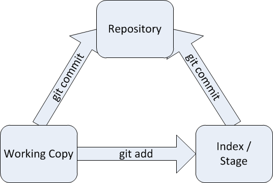
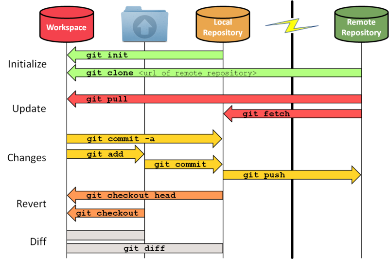

% Git and GitLab Basics
% Tobias Rueetschi
% May 15, 2018


Be smart. Think open source.

{height=100px}
{height=100px}

---

# Version Control Systems

* See who changed when why what

---

## Benefits

* Restore

* Archive

* Collaboration

---

## Server - Client

{width=400px}

## Server - Client

* server-client

* CVS, SVN, ...

## Distributed

{width=400px}

## Distributed

* Distributed

* Git, Mercurial, ...

---

## Git

Distributed offline VCS

{height=50px}

## Working Copy, Stash, Commit

{width=600px}

## Remote Handling

{width=600px}

## Log

```Bash
git log --graph --decorate --abbrev-commit --all --pretty=oneline
```

---

## Git Getting started

## Configure

```Bash
git config user.name "John Doe"
git config user.email "john.doe@example.org"
```

## Create first project

```Bash
git init project1
cd project1
```

## Create files and add them

```Bash
touch file1
git add file1  # (not persistent, only signaling)
git commit -m "My first commit"  # (persistent)
```

---

## Git Branches

## Create a new branch

```Bash
git branch feature-1                  # create a branch
git checkout -b feature-2             # create and switch to branch
touch file2
git add file2                         # stage file for next commit
git commit -m "Adding feature file2"  # commit the changes
```

## Merge branch into master

* Fast-forward (default)

```Bash
git checkout master
git merge feature-2
```

* No-fast-forward

```Bash
git checkout master
git merge --no-ff feature-2
```

---

# Hands-on

[https://try.github.io/](https://try.github.io/)

---

### Preparing

```Bash
# clone a remote repository and switch into it
git clone https://github.com/keachi/octocat.git && cd octocat
git remote show
git remote show origin
```

### Checkout

```Bash
git checkout origin/dev -b dev
git checkout master
(create/edit some content)
git status
git checkout -- .  # undo changes
git checkout 5e620bb -B master
```

---

### Create branch

```Bash
# create branch feature-1
git checkout origin/master -B master
git branch feature-1
(or)
git checkout origin/master -B feature-1
```

### Show branches

```Bash
git branch            # list local branches
git branch --remotes  # list only remote branches
git branch --all      # list all branches
```

### Delete a branch

```Bash
git branch -d feature-1
```

---

### Create a merge

```Bash
# create branch feature-1
git checkout origin/master -B feature-1
(add an exclamation mark to the end of the line in octocat.txt)
git add .
git commit -m 'some comment'
git merge origin/dev  # a merge confict happens
git status
```

### Fix merge conflicts

```Bash
git diff
(fix the confict with your favorite editor)
git diff
git add octocat.txt
git merge --continue
```

---

### History

```Bash
git log
git log --oneline --decorate --graph --all
```

---

### Remotes

```Bash
(open a terminal in another empty directory)
$ git init --bare
$ pwd
/home/user/bare
$ (go to your first repository)
$ pwd
/home/user/octocat
$ git remote add bare /home/user/bare
$ git remote show
```

### Push and pull

```Bash
git checkout master   # switch from feature-1 to master branch
git branch --remotes  # nothing in repository bare
git push bare master  # push local master to remote bare
git branch --set-upstream-to=bare/master  # track remote branch
git branch --remotes  # branch master is in repository bare too
git fetch bare        # fetch changes from bare
git push bare :master # remove branch master from remote bare
```

---

### Cherry-Picking

```Bash
# Use one single commit and apply it to the local branch
git cherry-pick d17cfc8  # <-- points to a commit on
                         #     https://github.com/keachi/octocat
```

---

### Reset

```Bash
# reset all tracked files and checkout branch master
git reset --hard master
```

---

### Tags

```Bash
# create a tag on the current commit
git tag v1.0.0 -m 'Version 1.0.0'
# create a tag on a specific commit
git tag v0.5.0 -m 'Version 0.5.0' 5e620bb
git push --tags
# list all tags
git tag
```

---

### Cleanup Git repository

```Bash
# cleanup unnecessary files and optimize the local repository
git gc
```

---

# GitLab

{height=50px}

---

## Features

* Pages

* Wiki

* Issues

* Merge requests

* Todos

* Milestones

## Advanced Features

* CI/CD pipelines

* Issue and MR templates

* Container registry

---

## Users

* Admin permissions

    * Standard user

    * Group owner

    * GitLab admin

* [Permissions](https://docs.gitlab.com/ee/user/permissions.html)

---

## Groups

* Project namespace

* User permissions

---

## Project settings

* Project permissions

* Issue template

* Merge Request method

* Approvals

## Members

* Grant access by groups

* Add special access to users or groups

* [Permissions](https://docs.gitlab.com/ee/user/permissions.html)

## Integrations

* Webhooks

* Trigger by different actions

* Services, e.g.

    * Jira

    * Bugzilla

    * Mattermost

## Deploy keys

* Special SSH Keys for deploying

* Full repository access

* Used to deploying and in CI/CD

* Access restriction

## Protected Branches

* Allow only some users to push to certain branches

* Allow only to merge in certain branches

## Runners

* Worker for CI/CD pipelines

* Enforce additional rules for merging

* Run after push on HEAD

## Variables

* Key-Value-pair

* Used in CI/CD as environment variables

* e.g.

    * Credentials

    * Run parameters

## Triggers

* Trigger a URL for special API calls

* e.g.

    * build documentation

    * deploy website

## CI/CD pipelines

* Run on special GitLab worker hosts

* e.g.

    * Compile software

    * Run linting software

* Create artifacts

* [Pipelines and jobs](https://docs.gitlab.com/ce/ci/pipelines.html)

* [.gitlab-ci.yml](https://docs.gitlab.com/ce/ci/yaml/README.html)

---

## Project features

* Issues

* Merge requests

* Milestones

* Wiki

## Issues

* Issue tracker

* Manage project issues

* Labels

* Milestones

* Assign to someone

* Time tracking

* Due date

* Weight

## Merge requests

* Corresponding branch (same or forked repository)

* Reviewing code before merge into master

* Comments

* CI/CD pipeline

* Work in progress (WIP)

* Fix/resolv issue

---

## Administration Interface

* Global Administration

    * Project

    * User

    * Group

* Monitoring


## GitLab Update Cycle

* Released frequently (monthly on the 22nd)

* Update badge in admin area

    * asap: Security issues

    * soon: New features

    * up-to-date: Newest version

---

## Documentation

* [Documentation](https://docs.gitlab.com/ce/README.html)

* [Workflow](https://docs.gitlab.com/ce/workflow/README.html)

* [GitLab Flow](https://docs.gitlab.com/ce/workflow/gitlab_flow.html)

---

## Thank you!

Be smart. Think open source.


---

## Feel Free to Contact Us

[www.adfinis-sygroup.ch](https://www.adfinis-sygroup.ch)

[Tech Blog](https://www.adfinis-sygroup.ch/blog)

[GitHub](https://github.com/adfinis-sygroup)

<info@adfinis-sygroup.ch>

[Twitter](https://twitter.com/adfinissygroup)

---

## Attribution / License

* Git Handling, by ferqwerty<br />
  MIT License,<br />
  https://github.com/fer/dotfiles/wiki/git
