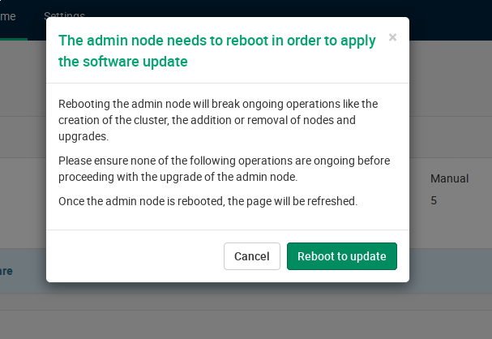
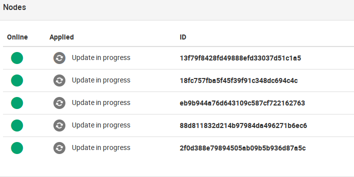
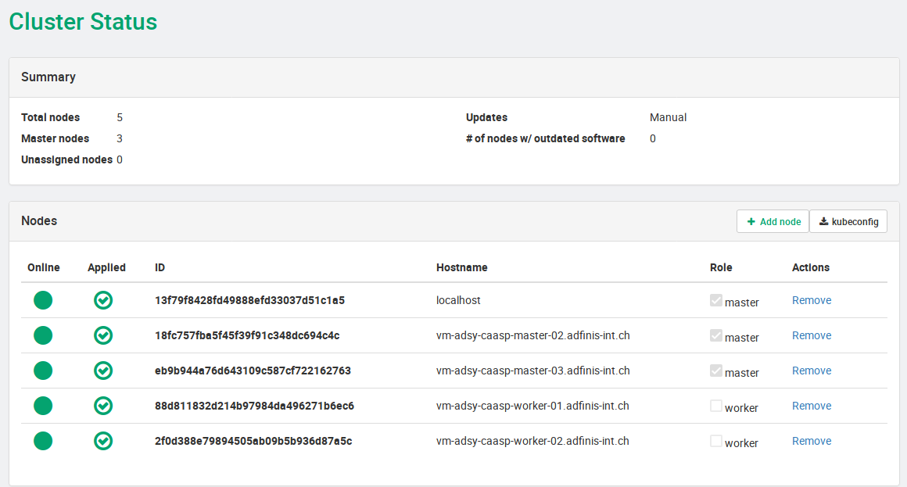

% Kubernetes Maintenance
% Toni Tauro

Be smart. Think open source.

# Kubernetes Maintenance

---

# Managed Solutions 

---

## Pro

* managed upgrades
* managed provisioning of new nodes
* issues are fixed and tested by the supplier

## Contra

* bound to release schedule
* official bugfixes do not have to work

# Plain K8S

---

## Pro

* freedom
* community driven project

## Contra

* manual upgrade
* manual provisioning of new nodes

---

# SuSe Caasp Admin Interface / Velum UI

* admin UI for managing your cluster 
* checking state of cluster
* upgrading nodes
* adding/removing nodes

# Upgrade process in CaasP

---

---

---

---

---

---

## Feel Free to Contact Us

[www.adfinis-sygroup.ch](https://www.adfinis-sygroup.ch)

[Tech Blog](https://www.adfinis-sygroup.ch/blog)

[GitHub](https://github.com/adfinis-sygroup)

<info@adfinis-sygroup.ch>

[Twitter](https://twitter.com/adfinissygroup)
