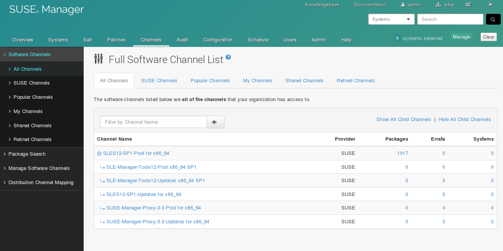

% SUSE Manager 3 Sync SMT
% Marc Stulz
% November 10, 2016


Be smart. Think open source.

# SUSE Manager 3 Hands-on


---

## Hands-on :: SMT Sync 02

Configure SMT in SUMA and synchronize the channels.

---

## SMT Sync 02 - Configuration

Modify `/etc/fstab` and mount the SMT data disk (`/dev/vdc1`):

```text
UUID=58de515b-d594-482d-9368-5ecfe5691fbb /data xfs defaults 0 2
```

```text
# mkdir /data

# mount -a
```

## SMT Sync 02 - Configuration

Configure the local data directory in `/etc/rhn/rhn.conf`, restart tomcat and synchronize the channels:

```text
[...]
# local data directory
server.susemanager.fromdir = /data/repos_init_20161109
```

```text
# systemctl restart tomcat

# mgr-sync refresh

# mgr-sync list channels

# mgr-sync add channel $channel-label
```

## SMT Sync 02 - Required Channels

* sles12-sp1-pool-x86_64

* sles12-sp1-updates-x86_64

* sle-manager-tools12-pool-x86_64-sp1

* sle-manager-tools12-updates-x86_64-sp1

* suse-manager-proxy-3.0-pool-x86_64

* suse-manager-proxy-3.0-updates-x86_64

## SMT Sync 02 - Verification I

Check the synchronization log fils in `/var/log/rhn/reposync/`:

```text
# ls -la /var/log/rhn/reposync/
total 300
drwxr-xr-x 1 root   www    430 Nov  9 15:12 .
drwxrwx--- 1 root   www    360 Nov  9 10:55 ..
-rw-rw---- 1 wwwrun www   2034 Nov  9 15:11 sle-manager-tools12-pool-x86_64-sp1.log
-rw-rw---- 1 wwwrun www   9384 Nov  9 15:12 sle-manager-tools12-updates-x86_64-sp1.log
-rw-rw---- 1 wwwrun www 161744 Nov  9 14:45 sles12-sp1-pool-x86_64.log
-rw-rw---- 1 wwwrun www 118187 Nov  9 15:11 sles12-sp1-updates-x86_64.log
-rw-rw---- 1 wwwrun www    311 Nov  9 15:12 suse-manager-proxy-3.0-pool-x86_64.log
-rw-rw---- 1 wwwrun www    317 Nov  9 15:12 suse-manager-proxy-3.0-updates-x86_64.log
```

## SMT Sync 02 - Verification II

Check the synchronization in the WebUI:



## SMT Sync 02 - Verification III

Check the synchronization with the `spacecmd` command:

```text
# spacecmd softwarechannel_list
INFO: Connected to https://localhost/rpc/api as admin
sle-manager-tools12-pool-x86_64-sp1
sle-manager-tools12-updates-x86_64-sp1
sles12-sp1-pool-x86_64
sles12-sp1-updates-x86_64
suse-manager-proxy-3.0-pool-x86_64
suse-manager-proxy-3.0-updates-x86_64

# spacecmd softwarechannel_details sles12-sp1-updates-x86_64
INFO: Connected to https://localhost/rpc/api as admin
Label:              sles12-sp1-updates-x86_64
Name:               SLES12-SP1-Updates for x86_64
Architecture:       x86_64
Parent:             sles12-sp1-pool-x86_64
Systems Subscribed: 0
Number of Packages: 2140

Summary
-------
SUSE Linux Enterprise Server 12 SP1 x86_64

Description
-----------
SUSE Linux Enterprise offers a comprehensive suite of products built
on a single code base. The platform addresses business needs from the
smallest thin-client devices to the world's most powerful high-
performance computing and mainframe servers. SUSE Linux Enterprise
offers common management tools and technology certifications across
the platform, and each product is enterprise-class.

GPG Key:            
GPG Fingerprint:    
GPG URL:            

Repos
-----
sles12-sp1-updates-x86_64

```

---

## Feel Free to Contact Us

[www.adfinis-sygroup.ch](https://www.adfinis-sygroup.ch)

[Tech Blog](https://www.adfinis-sygroup.ch/blog)

[GitHub](https://github.com/adfinis-sygroup)

<info@adfinis-sygroup.ch>

[Twitter](https://twitter.com/adfinissygroup)
