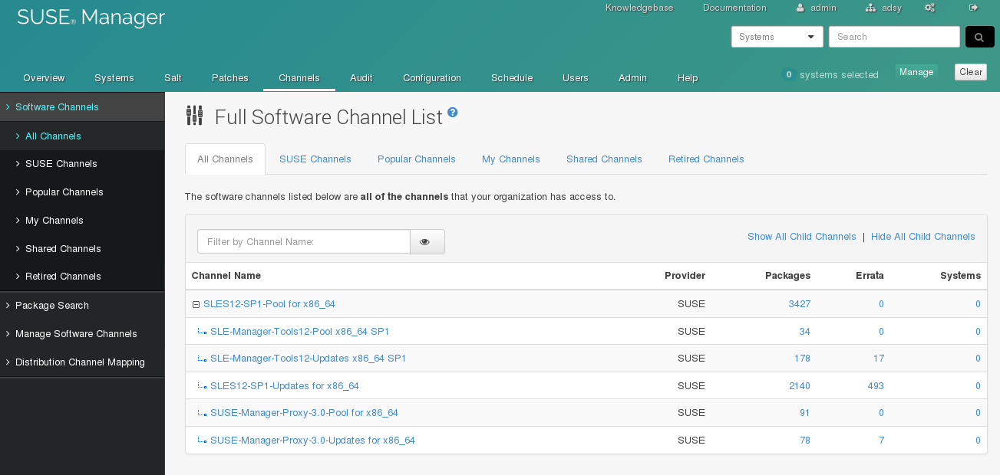

% SUSE Manager Channel Management
% Marc Stulz
% November 10, 2016


Be smart. Think open source.

# SUSE Manager 3 Hands-on


---

## Hands-on :: Channels 03

Channel Management: Create a workflow, clone channels and create activation keys

---

## Channels 03 - Channels

Install the `spacewalk-utils` package on your SUMA:

```text
# zypper -n install spacewalk-utils
```

## Channels 03 - Channels

Configure a cumstom workflow a la "adsy-sles12-sp1":

```text
# cat .spacewalk-manage-channel-lifecycle/settings.conf
[general]
phases = dev, test, prod
exclude channels =

[adsy-sles12-sp1]
phases = devl, prod
exclude channels =

# export pass="verysecure"
```

## Channels 03 - Channels

List the current channels and your workflow:

```text
# spacewalk-manage-channel-lifecycle -u admin -p "$pass" -f

# spacewalk-manage-channel-lifecycle -u admin -p "$pass" -l
```

## Channels 03 - Channels



## Channels 03 - Development Channel

Create a development channel from the vendor channel:

```text
# spacewalk-manage-channel-lifecycle -u admin -p "$pass" \
                                     -w adsy-sles12-sp1 \
                                     --channel sles12-sp1-pool-x86_64 \
                                     --init

# spacewalk-manage-channel-lifecycle -u admin -p "$pass" -l
```

## Channels 03 - Production Channels

Create a producation channel from the development channel:

```text
# spacewalk-manage-channel-lifecycle -u admin -p "$pass" \
                                     -w adsy-sles12-sp1 \
                                     --channel devl-sles12-sp1-pool-x86_64 \
                                     --promote

# spacewalk-manage-channel-lifecycle -u admin -p "$pass" -l
```

## Channels 03 - Channels


## Channels 03 - Channels

Create an archive from the production channel:

```text
# spacewalk-manage-channel-lifecycle -u admin -p "$pass" \
                                     --channel prod-sles12-sp1-pool-x86_64 \
                                     --archive

# spacewalk-manage-channel-lifecycle -u admin -p "$pass" -l
```

## Channels 03 - Channels

Rollback the archive channel to the production channel:

```text
# spacewalk-manage-channel-lifecycle -u admin -p "$pass" \
                                     --channel archive-20161110-prod-sles12-sp1-pool-x86_64 \
                                     --rollback
```

---

## Channels 03 - `spacecmd` Configuration

Create a configuration file for the `spacecmd` command:

`~/.spacecmd/config `

```ini
[spacecmd]
server=localhost
username=admin
password=verysecure
nossl=0
```

---

## Channels 03 - Activation Keys

Create an activation key for salt development systems:

```text
# spacecmd activationkey_create
INFO: Connected to https://localhost/rpc/api as admin
Name (blank to autogenerate): ak-sles12sp1-devl-salt
Description [None]: activation key for sles12 sp1 salt development systems

Base Channels
-------------
archive-20161110-prod-sles12-sp1-pool-x86_64
devl-sles12-sp1-pool-x86_64
prod-sles12-sp1-pool-x86_64
sles12-sp1-pool-x86_64

Base Channel (blank for default): devl-sles12-sp1-pool-x86_64

virtualization_host Entitlement [y/N]:

Universal Default [y/N]:
INFO: Created activation key 1-ak-sles12sp1-devl-salt

# spacecmd activationkey_list
```

## Channels 03 - Activation Keys

List the details of the salt development actvation key:

```text
# spacecmd activationkey_details 1-ak-sles12sp1-devl-salt
INFO: Connected to https://localhost/rpc/api as admin
Key:                    1-ak-sles12sp1-devl-salt
Description:            activation key for sles12 sp1 development systems
Universal Default:      False
Usage Limit:            0
Deploy Config Channels: False
Contact Method:         default

Software Channels
-----------------
devl-sles12-sp1-pool-x86_64

Configuration Channels
----------------------

Entitlements
------------

System Groups
-------------

Packages
--------
```

## Channels 03 - Activation Keys

Add the child channels to the salt development activation key:

```text
# spacecmd softwarechannel_listchildchannels

# spacecmd activationkey_addchildchannels \
           1-ak-sles12sp1-devl-salt \
           devl-sles12-sp1-updates-x86_64 \
           devl-sle-manager-tools12-pool-x86_64-sp1 \
           devl-sle-manager-tools12-updates-x86_64-sp1

# spacecmd activationkey_details 1-ak-sles12sp1-devl-salt
```

## Channels 03 - Activation Key

Create an activation key for the salt producation systems:

```text
# spacecmd activationkey_create
INFO: Connected to https://localhost/rpc/api as admin
Name (blank to autogenerate): ak-sles12sp1-prod-salt
Description [None]: activation key for sles12 sp1 salt production systems                                      

Base Channels
-------------
archive-20161110-prod-sles12-sp1-pool-x86_64
devl-sles12-sp1-pool-x86_64
prod-sles12-sp1-pool-x86_64
sles12-sp1-pool-x86_64

Base Channel (blank for default): prod-sles12-sp1-pool-x86_64

virtualization_host Entitlement [y/N]:

Universal Default [y/N]:
INFO: Created activation key 1-ak-sles12sp1-prod-salt

# spacecmd activationkey_list
```

## Channels 03 - Activation Key

Add the child channels to the salt production activation key:

```text
# spacecmd softwarechannel_listchildchannels

# spacecmd activationkey_addchildchannels \
           1-ak-sles12sp1-prod-salt \
           prod-sles12-sp1-updates-x86_64 \
           prod-sle-manager-tools12-pool-x86_64-sp1 \
           prod-sle-manager-tools12-updates-x86_64-sp1

# spacecmd activationkey_details 1-ak-sles12sp1-prod-salt
```

## Channels 03 - Activation Key

Create an activation key for the traditional producation systems:

```text
# spacecmd activationkey_create
INFO: Connected to https://localhost/rpc/api as admin
Name (blank to autogenerate): ak-sles12sp1-prod-trad
Description [None]: activation key for traditional sles12 sp1 production

Base Channels
-------------
archive-20161110-prod-sles12-sp1-pool-x86_64
devl-sles12-sp1-pool-x86_64
prod-sles12-sp1-pool-x86_64
sles12-sp1-pool-x86_64

Base Channel (blank for default): prod-sles12-sp1-pool-x86_64

virtualization_host Entitlement [y/N]:

Universal Default [y/N]:
INFO: Created activation key 1-ak-sles12sp1-prod-trad

# spacecmd activationkey_list
```

## Channels 03 - Activation Key

Add the child channels to the traditional production activation key:

```text
# spacecmd softwarechannel_listchildchannels

# spacecmd activationkey_addchildchannels \
           1-ak-sles12sp1-prod-trad \
           prod-sles12-sp1-updates-x86_64 \
           prod-sle-manager-tools12-pool-x86_64-sp1 \
           prod-sle-manager-tools12-updates-x86_64-sp1

# spacecmd activationkey_details 1-ak-sles12sp1-prod-trad
```

## Channels 03 - Activation Key

Add the required packages to the acvivation key:

```text
# spacecmd activationkey_addpackages \
           1-ak-sles12sp1-prod-trad \
           rhncfg-actions \
           osad \
           rhncfg-client \
           rhncfg-management

# spacecmd activationkey_details 1-ak-sles12sp1-prod-trad
```

##  Channels 03 - Activation Keys in the WebUI


---

## Feel Free to Contact Us

[www.adfinis-sygroup.ch](https://www.adfinis-sygroup.ch)

[Tech Blog](https://www.adfinis-sygroup.ch/blog)

[GitHub](https://github.com/adfinis-sygroup)

<info@adfinis-sygroup.ch>

[Twitter](https://twitter.com/adfinissygroup)
