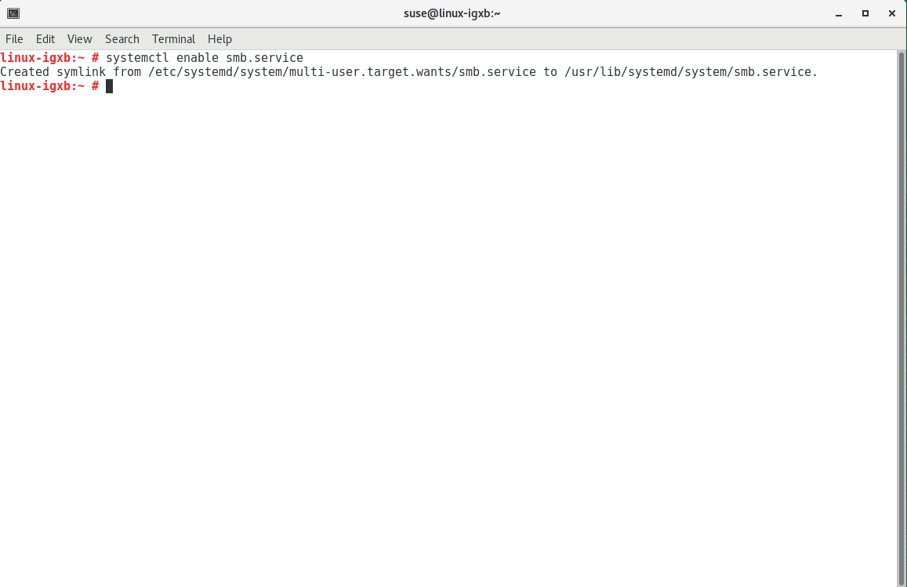
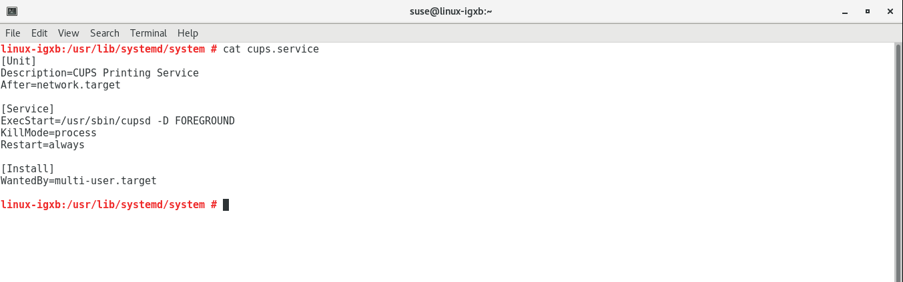

Be smart. Think open source.

# Demo zu Module „systemd" [SSA 1001]

---

## Dienst automatisch starten



---

## Dienst manuell starten & Status prüfen


---

## Boot Analyse in SVG rendern


---

## Unit File prüfen, Restart aktivieren



---

## Dienst killen und Restart prüfen


## Timer Beispiel 1/4

* Periodisch die aktuelle Zeit in eine File loggen

/opt/logger.sh

```shell
#!/bin/bash
date --rfc-3339=seconds >> /tmp/logger.log
```

---

## Timer Beispiel 2/4

```shell
/etc/systemd/system/logger.timer
[Unit]
Description=Dummy logger timer

[Timer]
# 50s after booting the machine
OnBootSec=50s
# Interval
OnUnitActiveSec=30

[Install]
WantedBy=timers.target
```

---

## Timer Beispiel 3/4
```shell
/etc/systemd/system/logger.service
[Unit]
Description=Dummy logger
DefaultDependencies=no
After=local-fs.target
Before=shutdown.target

[Service]
Type=oneshot
ExecStart=/opt/logger.sh

[Install]
WantedBy=timers.target
```

---

## Timer Beispiel 4/4

* Neue Files in systemd laden
```shell
systemctl daemon-reload
```

* Time aktivieren
```shell
systemctl enable logger.timer logger.service
```

* Timer Aktivierung prüfen
```shell
systemctl list-timers
```

* Log File prüfen
```shell
tailf /tmp/logger.log
```

---

## Feel Free to Contact Us

[www.adfinis-sygroup.ch](https://www.adfinis-sygroup.ch)

[Tech Blog](https://www.adfinis-sygroup.ch/blog)

[GitHub](https://github.com/adfinis-sygroup)

<info@adfinis-sygroup.ch>

[Twitter](https://twitter.com/adfinissygroup)
