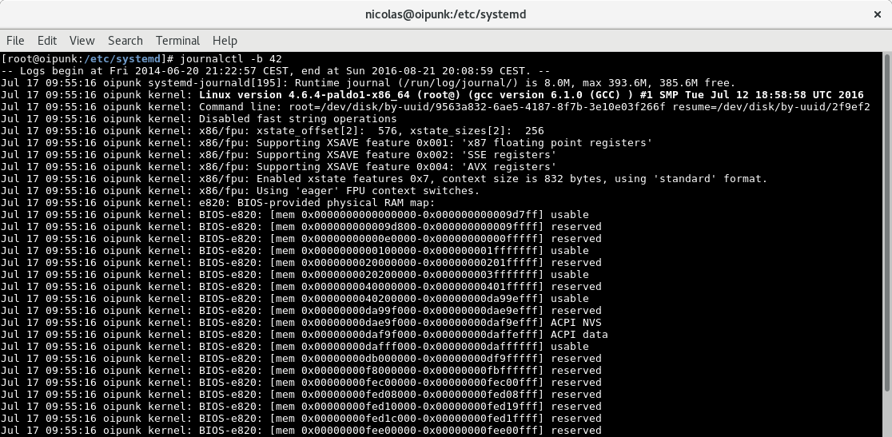
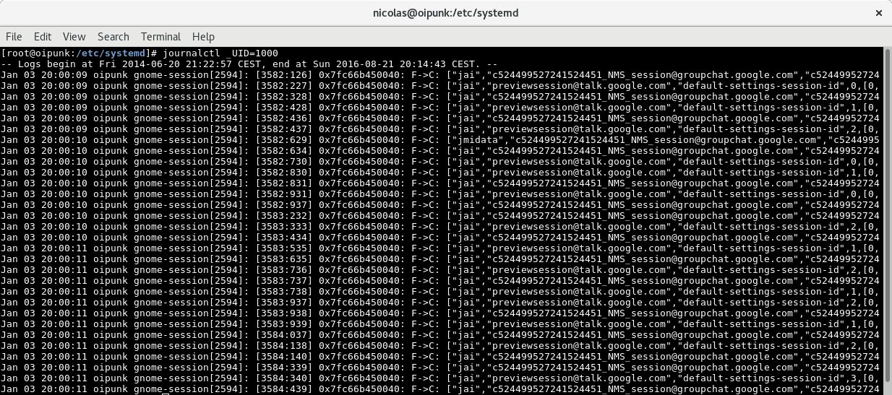

Be smart. Think open source.

# Demo zu Module "journald" [SSA 1002]

# Fortlaufendes Log anzeigen

# Log der letzten 3h anzeigen

# Spezifische Range von Log-Einträgen anzeigen

# Liste der bekannten System-Starts anzeigen

# Log-Einträge seit einem spezifischen System-Starts bis zum Shutdown anzeigen

# Alle Log-Einträge zu einem spezifischen Binary anzeigen

# Log-Einträge eines spezifischen Users anzeigen

# Attribution / License

* Slides

  Adfinis SyGroup AG, 2016, Attribution-NonCommercial 2.0 (CC BY-NC 2.0)

---

## Feel Free to Contact Us

[www.adfinis-sygroup.ch](https://www.adfinis-sygroup.ch)

[Tech Blog](https://www.adfinis-sygroup.ch/blog)

[GitHub](https://github.com/adfinis-sygroup)

<info@adfinis-sygroup.ch>

[Twitter](https://twitter.com/adfinissygroup)
