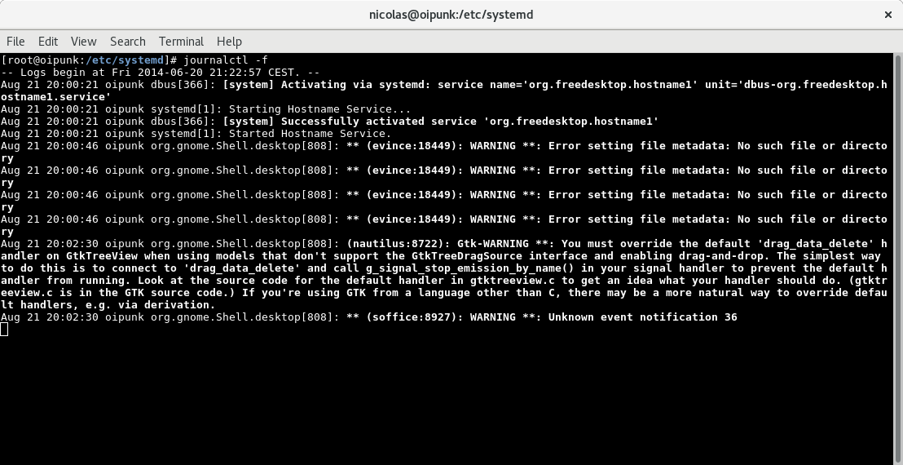
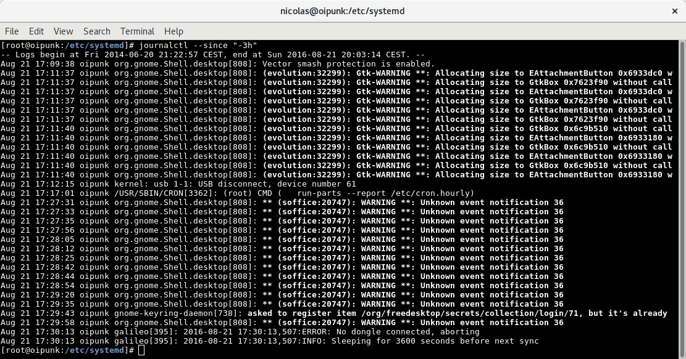
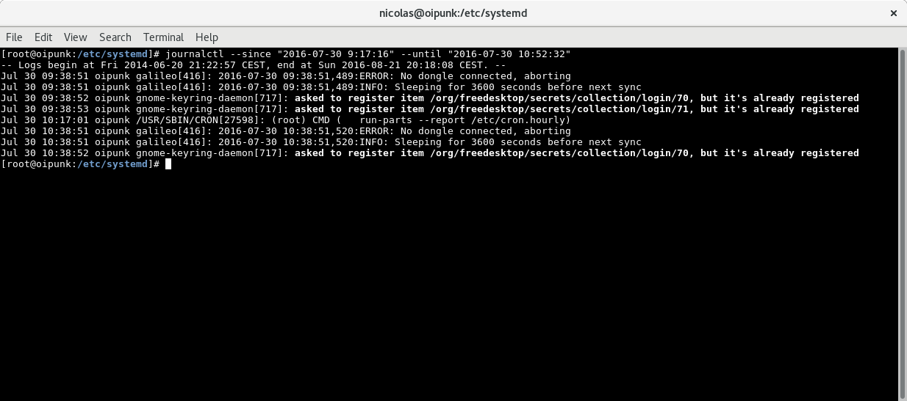
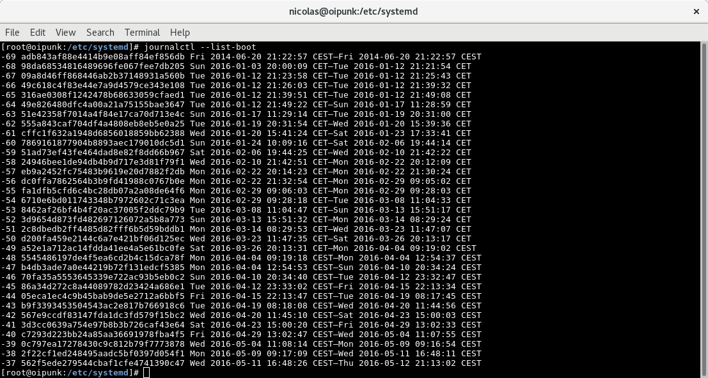
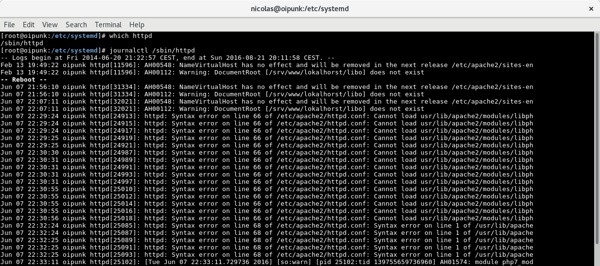

# Demo zu Module "journald" [SSA 1002]

# Fortlaufendes Log anzeigen

# Log der letzten 3h anzeigen

# Spezifische Range von Log-Einträgen anzeigen

# Liste der bekannten System-Starts anzeigen

# Log-Einträge seit einem spezifischen System-Starts bis zum Shutdown anzeigen

# Alle Log-Einträge zu einem spezifischen Binary anzeigen

# Log-Einträge eines spezifischen Users anzeigen

# Attribution / License

* Slides

  Adfinis SyGroup AG, 2016, Attribution-NonCommercial 2.0 (CC BY-NC 2.0)
