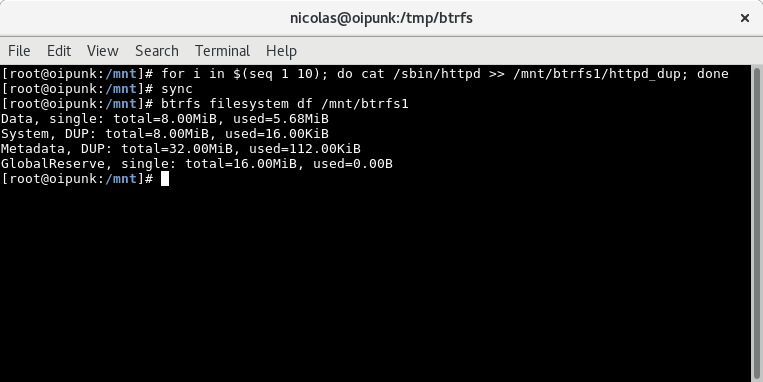
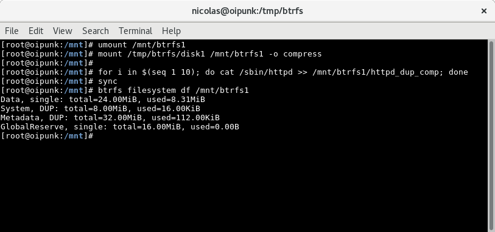
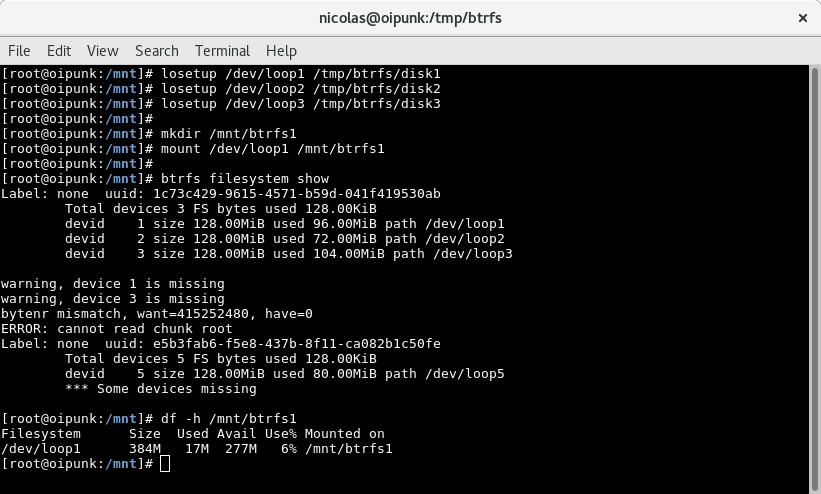
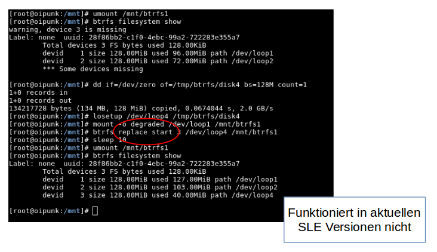
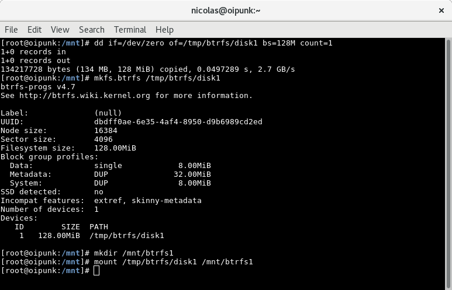

# Demo zu Module "btrfs" [SSA 1003]

# Kompression

# Disk mit btrfs erstellen und mounten

# Disk Belegung ohne Kompression

# Disk Belegung mit Kompression

# RAID 0

# Drei Disks erstellen & formatieren

# Loopback Devices erstellen & mounten

# Weiteres Volume hinzufügen

[Bild 6](demo6.png)

# RAID 1

# Drei Disks erstellen & formatieren

# Loopback Devices erstellen & mounten

# File erstellen und Disk zerstören

# Degraded mounten

# Kaputte Disk entfernen und durch neue ersetzen

# Deduplizierung

# Disk erstellen und Kopien von Files darauf ablegen

# Deduplizierung starten und Belegung erneut prüfen

# Snapshot

# Disk mit btrfs erstellen & mounten

# Subvolumes mit Snapshots von zwei verschiedenen Files erstellen

# Alten Snapshot mounten

# Attribution / License

* Slides

  Adfinis SyGroup AG, 2016, Attribution-NonCommercial 2.0 (CC BY-NC 2.0)
