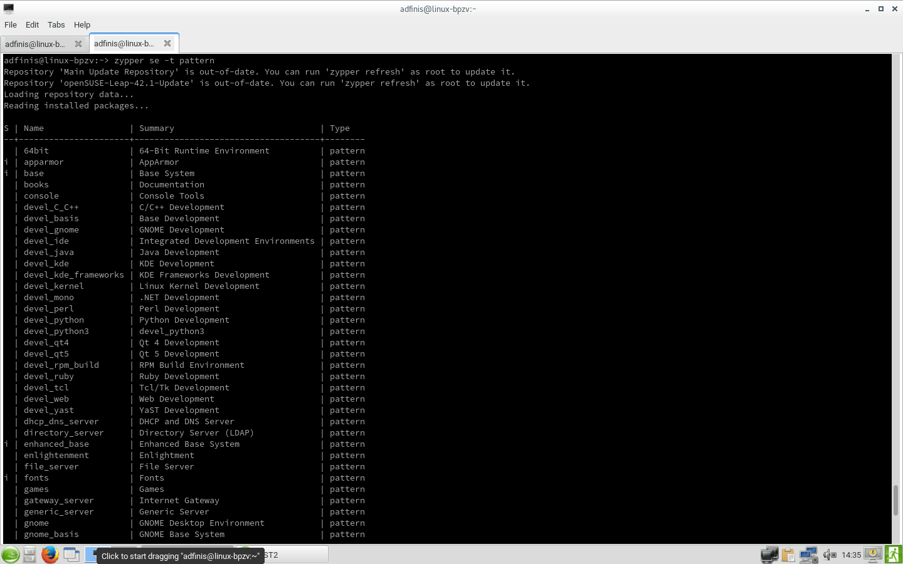
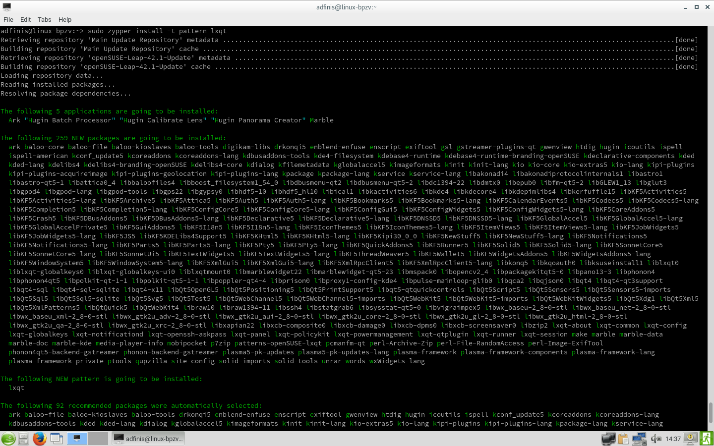
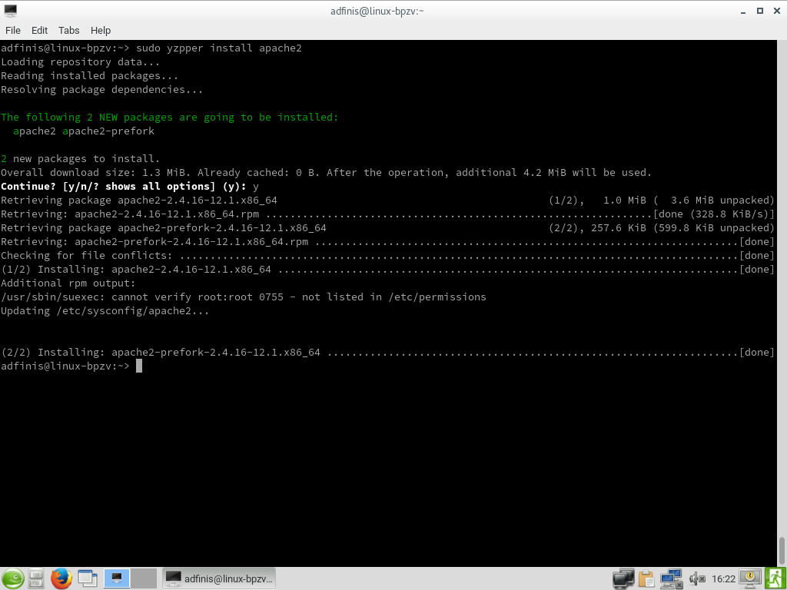
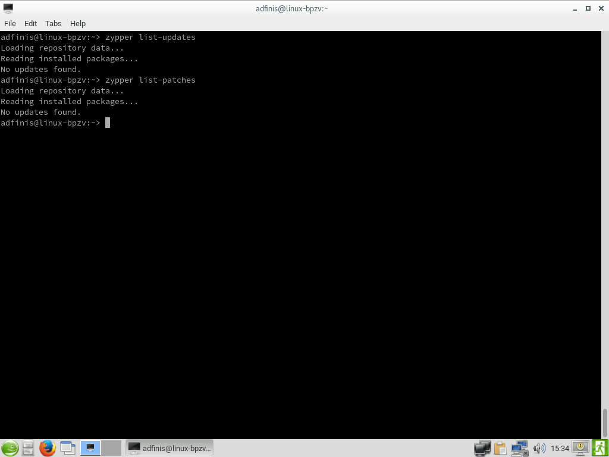

Be smart. Think open source.

# Demo zu Module "zypper" [SSA 1005]

# Paketgruppen suchen

# Paketgruppe installieren

# Paket für Installation suchen

# Infos zu Paket anzeigen

# Gesuchtes Paket installieren

# Paket deinstallieren

# Updates und Patches: Suchen und installieren

# Konfigurierte Repositories anzeigen

# Repository hinzufügen und löschen

# Repository deaktivieren und aktivieren

---

## Feel Free to Contact Us

[www.adfinis-sygroup.ch](https://www.adfinis-sygroup.ch)

[Tech Blog](https://www.adfinis-sygroup.ch/blog)

[GitHub](https://github.com/adfinis-sygroup)

<info@adfinis-sygroup.ch>

[Twitter](https://twitter.com/adfinissygroup)
