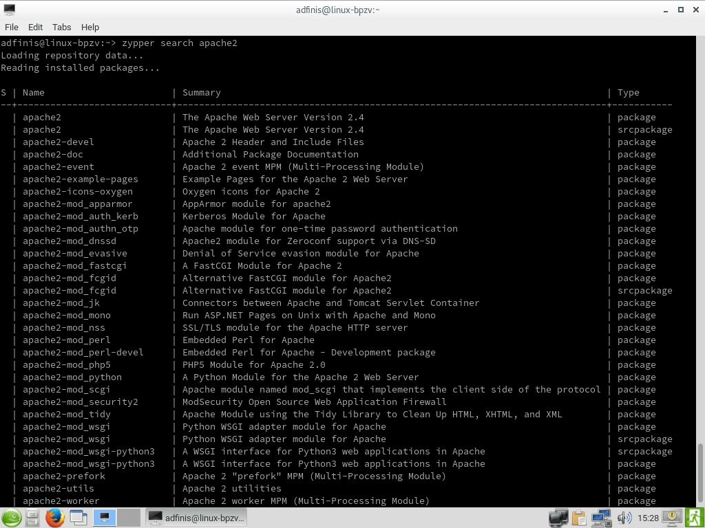
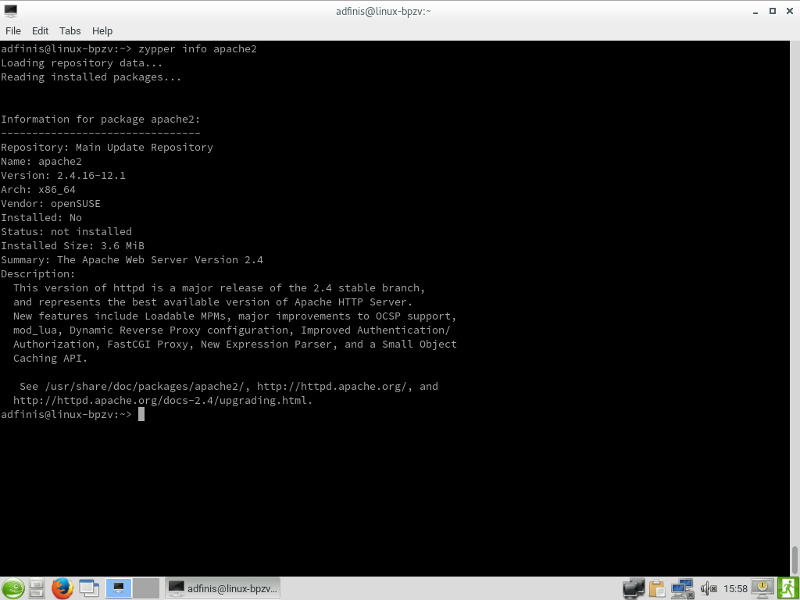
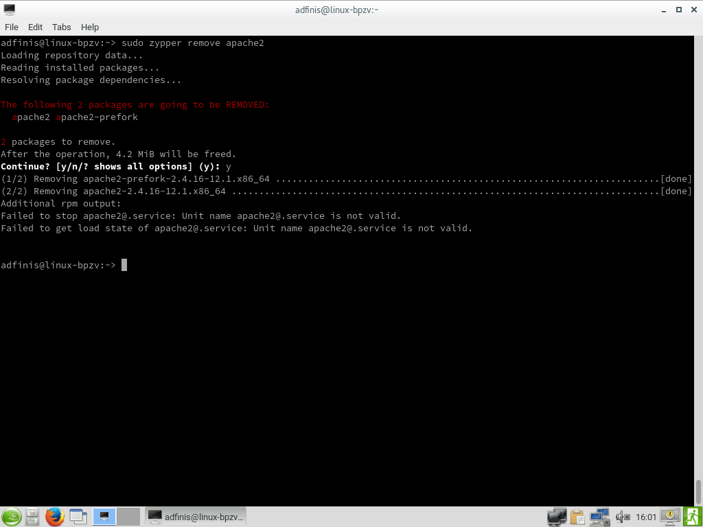
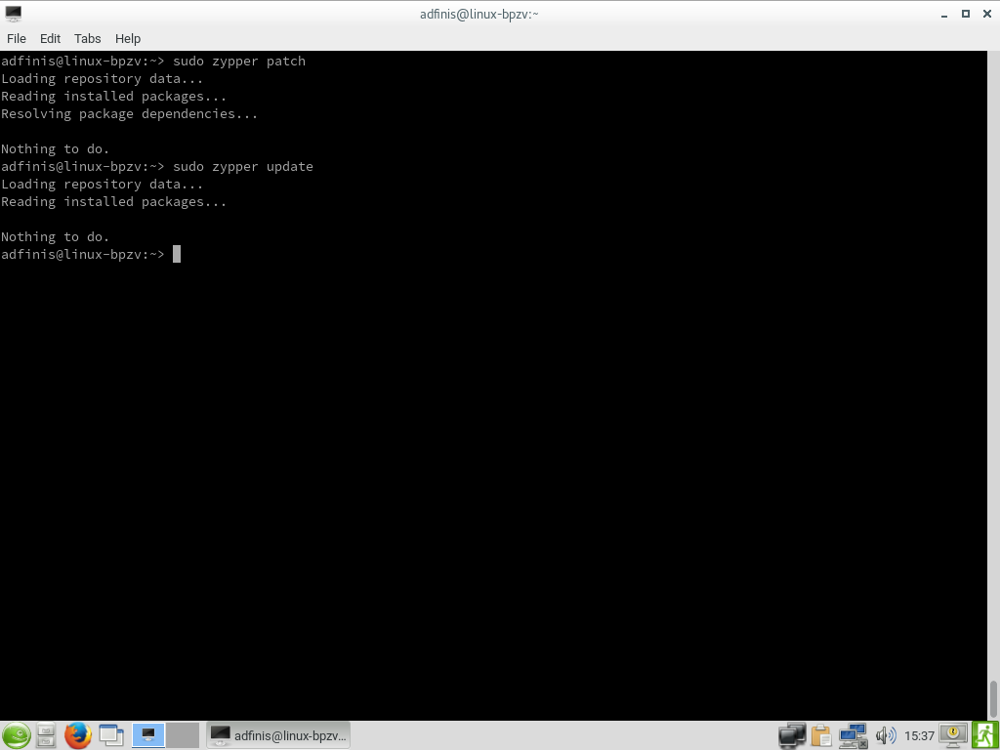
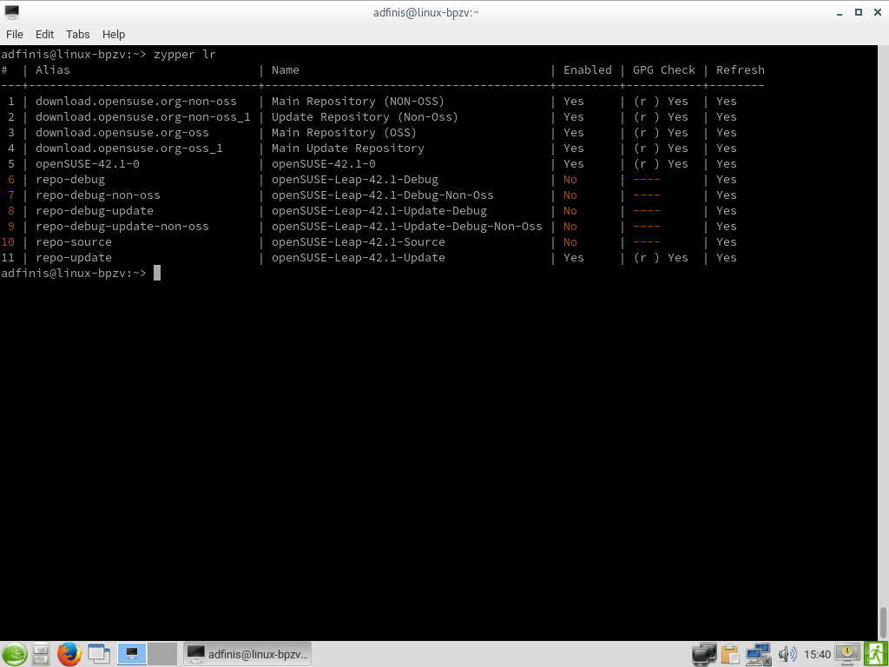
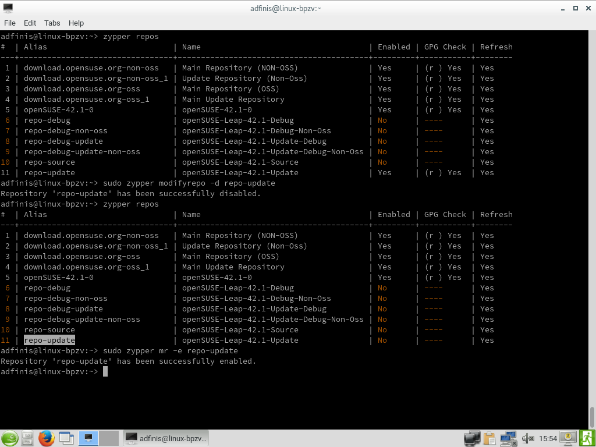

# Demo zu Module "zypper" [SSA 1005]

# Paketgruppen suchen

# Paketgruppe installieren

# Paket für Installation suchen

# Infos zu Paket anzeigen

# Gesuchtes Paket installieren

# Paket deinstallieren

# Updates und Patches: Suchen und installieren

# Konfigurierte Repositories anzeigen

# Repository hinzufügen und löschen

# Repository deaktivieren und aktivieren

