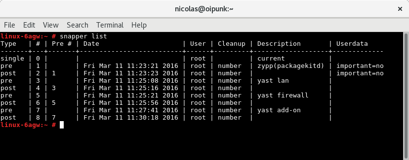
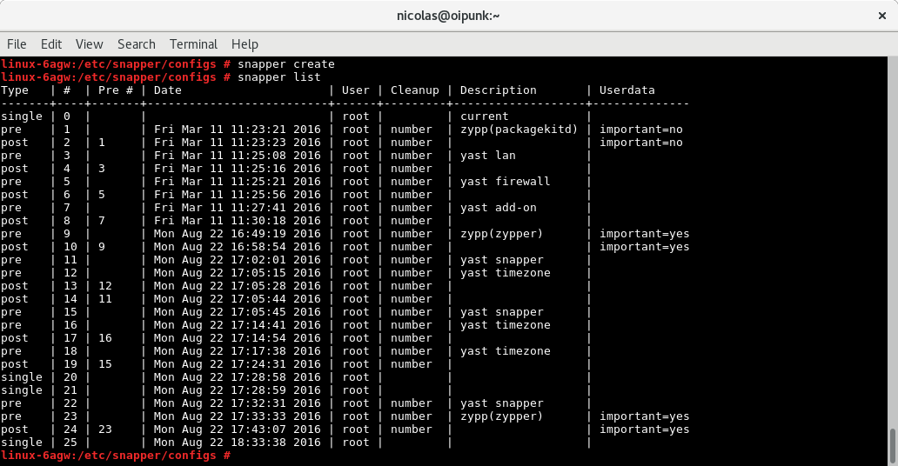
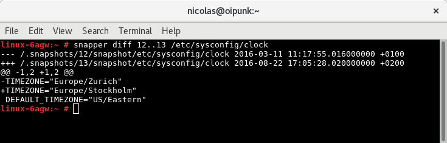
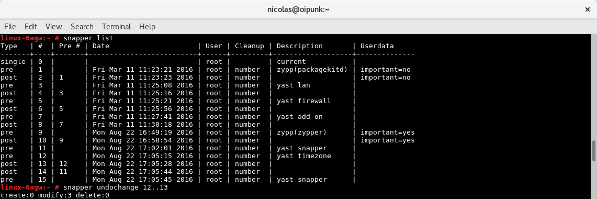
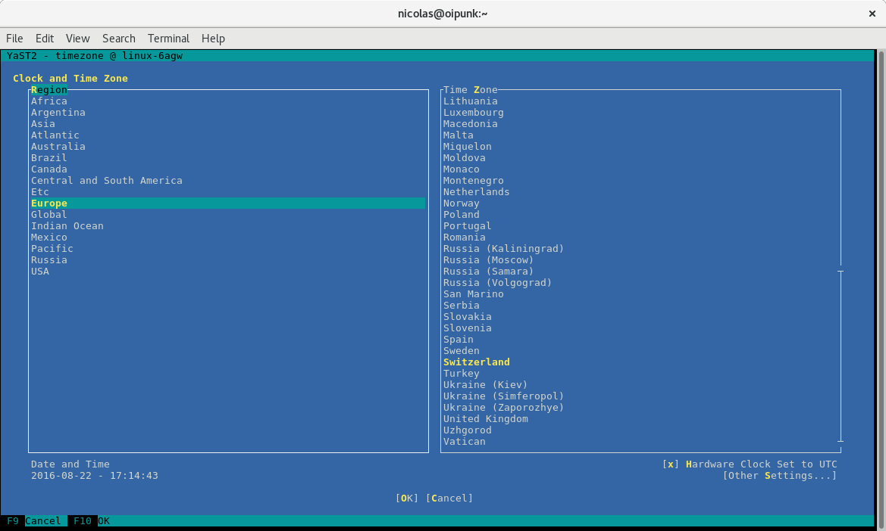

# Demo zu Module "snapper" [SSA 1006]

# Snapper Integration in YAST und zypper

# Vor dem Update...

# Nach dem Update...

# Ansicht in YAST

# Manuellen Snapshot erstellen

# Manuell erstellten Snapshot anzeigen

# Diff zwischen Snapshots anzeigen

# Snapshot Unterschiede auf der CLI anzeigen

# Snapshot Unterschiede eines Files auf der CLI anzeigen

# Snapshot Unterschiede im YAST anzeigen

# Änderungen rückgängig machen

# Änderungen prüfen

# Attribution / License

* Slides

  Adfinis SyGroup AG, 2016, Attribution-NonCommercial 2.0 (CC BY-NC 2.0)
