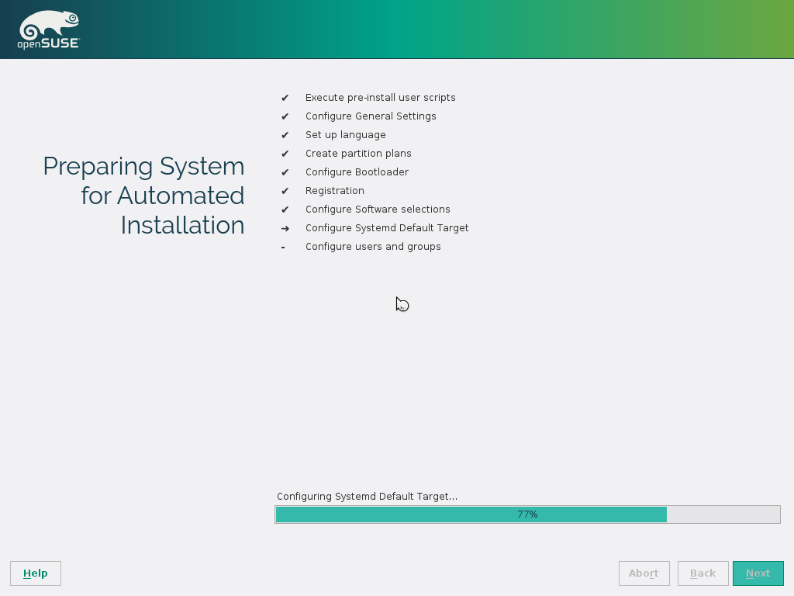
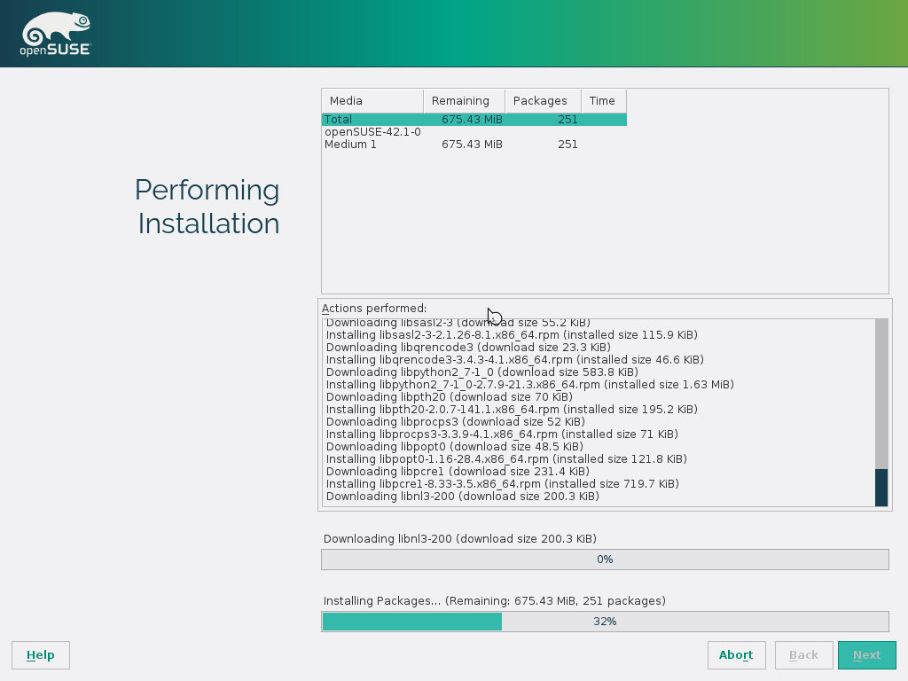

# Demo zu Module "zypper" [SSA 1005]

# autoyast-Profil generieren

# autoyast ausführen

# Screencast

# Attribution / License

* Slides, Screencast und Screenshots

  Adfinis SyGroup AG, 2016, Attribution-NonCommercial 2.0 (CC BY-NC 2.0)
