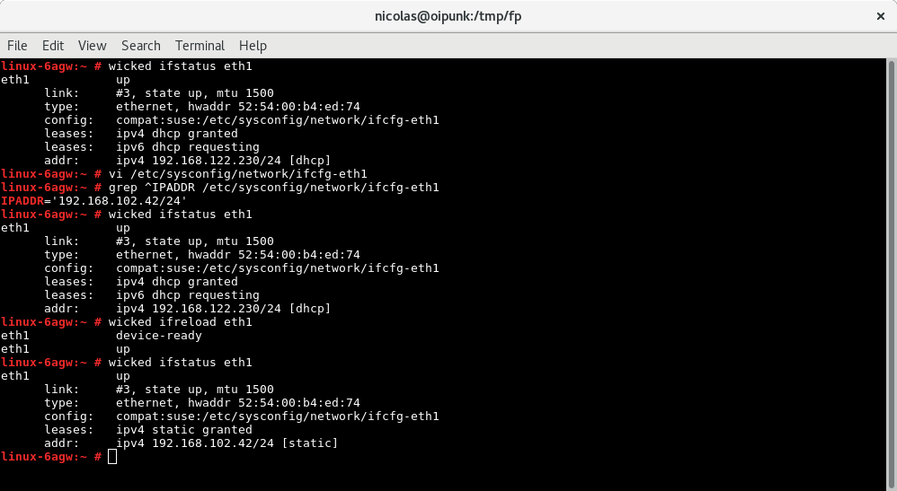
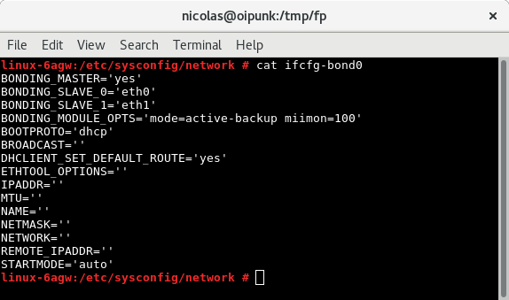
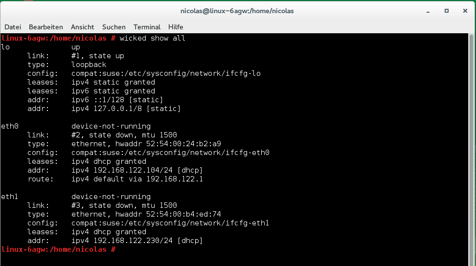

# Demo zu Module "wicked" [SSA 1009]

# Basis Funktionen

# Interface Konfiguration übernehmen

# Bondings

# Bond erstellen (YAST oder Config-File)

# Bond deaktiviert

# Bond aktivieren

# Attribution / License

* Slides
Adfinis
SyGroup AG, 2016, Attribution-NonCommercial 2.0
(CC BY-NC 2.0)
