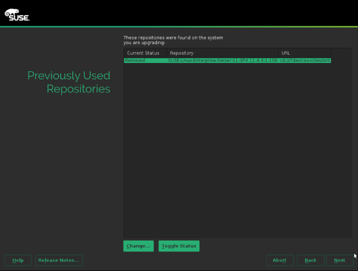
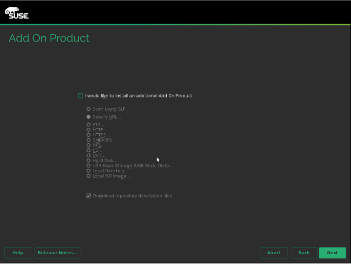

% SLES 12 SP Migration
% Marc Stulz
% November 18, 2016


Be smart. Think open source.


#  SLES 12 - Hands-on


---

## Hands-on :: SP Migration 10

Upgrading a SLES11 SP4 system manually.

---

## SP Migration 10 - Start Upgrade

Boot from installation medium (SLES12SP1) and select "Upgrade":


## SP Migration 10 - Welcom screen

Choose Language and Keyboard and accept the license agreement:


## SP Migration 10 - Partition

Select partition to upgrade:


## SP Migration 10 - Previously Repo

Remove previosly used repositories:



## SP Migration 10 - Registration

Skip registration:


## SP Migration 10 - Add Ons

Do not add other products:



## SP Migration 10 - Settings

Here you can change the setting, befor the upgrade starts:


---

## SP Migration 10 - Verify

Check the OS release, kernel version and the repositories:

```text
# cat /etc/os-release

# rpm -qa kernel*

# zypper lr
```

## SP Migration 10 - Orphaned Packages

Check for any orphaned packages:

```text
# zypper packages --orphaned
```

---

## Feel Free to Contact Us

[www.adfinis-sygroup.ch](https://www.adfinis-sygroup.ch)

[Tech Blog](https://www.adfinis-sygroup.ch/blog)

[GitHub](https://github.com/adfinis-sygroup)

<info@adfinis-sygroup.ch>

[Twitter](https://twitter.com/adfinissygroup)
