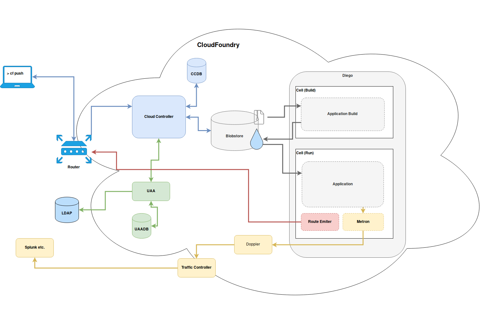

Be smart. Think open source.

# Components of SUSE CAP 

## CF Architecture

## Router

* Routes incoming traffic to appropriate component
* Can be cc component or hosted application
* Queries BBS for routing information

## Oauth2 Server (UAA) and Login Server

* Provide Identity Management
* User Account and Authentication Server
* Database for state
* Attachment to LDAP or other IAM solutions optional
* Checks if user are authenticated and authorized

## Cloud Controller 

* Main component of Cloud Foundry
* Directs deployment of applications
* Database for state
* Communicating with Diego for building/deploying apps through CC-Bridge
* Knows about orgs, spaces, user roles, services and more

## nsync, BBS and Cell reps

* Constantly monitors state of applications 
* Reconciles with expected state if needed

## nsync

* Rececives messages from CC when app is being scaled
* Writes DesiredLRP into BBS

## BBS

* Monitors DesiredLRP with ActualLRP
* Launches/Kills instances 

## Cell Rep

* Monitors containers and provieds ActualLRP

## Blobstore

* Repository for large binary files
* Application code packages
* Buildpacks
* Droplets

## Diego Cell

* Runs application instances, application tasks and staging tasks as Garden containers on Diego Cells
* Diego cell rep manages lifecycle, reports state to BBS and emits logs and metrics to Loggregator

## Diego flow

## Diego flow

## Messaging / BBS

* Components communicate through HTTP and HTTPS protocols 
* Storing of temporary messages in Bulletin Board System (BBS)

## Route Emiter

* Communication between diego cell and GoRouter
* Uses NATS Protocol to broadcast latest routing table to GoRouter

## Loggregator

* Streams application logs to developers
* Metron Agent in Diego Cell
* Doppler / Traffic Controller

## Loggregator

## Metrics Collector

* Gathers metrics and stats from components
* Informations can be used to monitor Deployments

# Diego Architecture

## Diego Cell Components

* Rep
* Garden
* Metron Agent
* Route-Emitter

## Diego Brain

* Auctioneer

## Databases

* BBS
* MySQL

## Access

* File Server serves static assets used in the app lifecycle
* SSH Proxy for connections with `cf ssh`

##  CC Bridge Components

* Stager
* CC-Uploader
* Nsync Bulker
* Nsync Listener
* TPS Listener
* TPS Watcher

## Locket

* Provides abstractions for locks and service registration
* Relies on a SQL backend for persistence
* Lives in the Database VM

## App Lifecycle Binaries

* Builder
* Launcher
* Healthcheck

## Simple whole picture

--- 

## Feel Free to Contact Us

[www.adfinis-sygroup.ch](https://www.adfinis-sygroup.ch)

[Tech Blog](https://www.adfinis-sygroup.ch/blog)

[GitHub](https://github.com/adfinis-sygroup)

<info@adfinis-sygroup.ch>

[Twitter](https://twitter.com/adfinissygroup)
