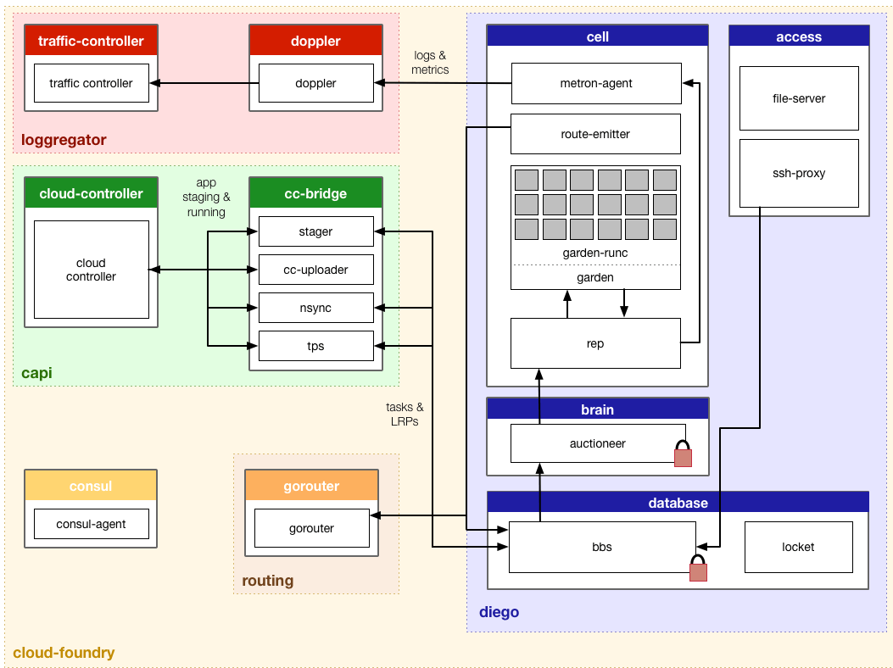

Be smart. Think open source.

# Components of SUSE CAP 

## UAA

* User Account and Authentication Server
* Database for state
* Attachment to LDAP optional
* Checks if user are authenticated and authorized

## Cloud Controller 

* Mail component of CloudFoundry
* Database for state
* Communicating with Diego for 

## Whole picture

## Diego flow

---

## Feel Free to Contact Us

[www.adfinis-sygroup.ch](https://www.adfinis-sygroup.ch)

[Tech Blog](https://www.adfinis-sygroup.ch/blog)

[GitHub](https://github.com/adfinis-sygroup)

<info@adfinis-sygroup.ch>

[Twitter](https://twitter.com/adfinissygroup)
