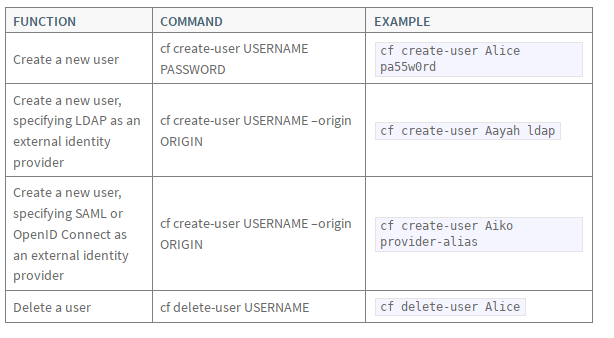
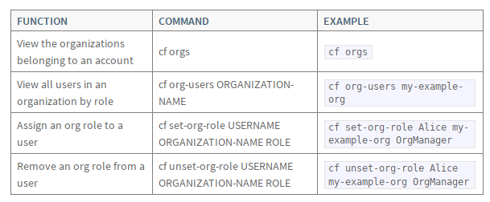
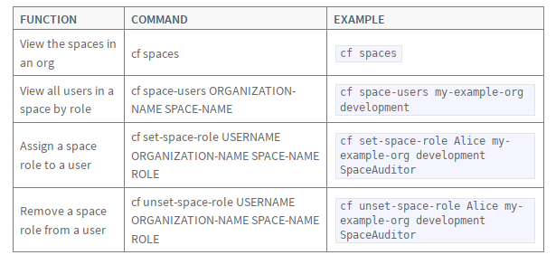
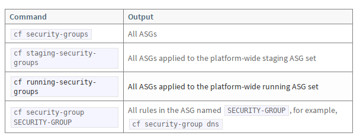

Be smart. Think open source.

# Operations / Administration

##  Buildpacks

--- 

## Add custom buildpacks

`cf create-buildpack BUILDPACK PATH POSITION`

## Update buildpacks

`cf update-buildpack BUILDPACK`

## Delete buildpacks

`cf delete-buildpack BULDPACK`

## Lock/unlock updates on buildpacks

`cf update-buildpack BUILDPACK --lock/--unlock`

## Disable custom buildpacks

`cc.disable_custom_buildpacks = true`

---

## Managing Users



## Managing Org Roles



## Managing App Space Roles



## Using the UUA CLI for addin Admins

```
$ gem install cf-uaac
$ uaac target uaa.example.com
$ uaac token client get admin -s MyAdminSecret
$ uaac user add Adam -p newAdminSecretPassword --emails newadmin@example.com
$ uaac member add cloud_controller.admin Adam
$ uaac member add uaa.admin Adam
```

---

## Quotas

## Create quotas

```
cf create-quota QUOTA \
[-m TOTAL-MEMORY] \ 
[-i INSTANCE-MEMORY] \
[-r ROUTES] \
[-s SERVICE-INSTANCES]
```

## List quotas

```
$ cf quotas
Getting quotas as admin@example.com...
OK

name           total memory limit   instance memory limit   routes       service instances   paid service plans
free           0                    0                       1000         0                   disallowed
paid           10G                  0                       1000        -1                   allowed
small          2G                   0                         10        10                   allowed
trial          2G                   0                       1000        10                   disallowed

```

## Modify quota

```
$ cf update-quota small -i 2048M \
-m 4096M -n medium -r 20 \
-s 20 --allow-paid-service-plans
```

## Space Quotas


* ` cf space-quotas`
* ` cf create-space-quota`
* ` cf update-space-quota`

---

##  Application Security Groups

## View ASG



## Create ASG

```
[
  {
    "protocol": "icmp",
    "destination": "0.0.0.0/0",
    "type": 0,
    "code": 0
  },
  {
    "protocol": "tcp",
    "destination": "10.0.11.0/24",
    "ports": "80,443",
    "log": true,
    "description": "Allow http and https traffic from ZoneA"
  }
]

```

## Create & Bind ASG


```
$ cf create-security-group my-asg my-asg.json
$ cf bind-staging-security-group my-asg
$ cf bind-running-security-group my-asg
```
---
## Feature Flags

```
$ cf feature-flags

Features                                      State
user_org_creation                             disabled
private_domain_creation                       enabled
app_bits_upload                               enabled
app_scaling                                   enabled
route_creation                                enabled
service_instance_creation                     enabled
diego_docker                                  disabled
set_roles_by_username                         enabled
unset_roles_by_username                       enabled
task_creation                                 enabled
env_var_visibility                            enabled
space_scoped_private_broker_creation          enabled
space_developer_env_var_visibility            enabled
service_instance_sharing                      disabled
hide_marketplace_from_unauthenticated_users   disabled
```

## Enable/Disable features

```
$ cf enable-feature-flag user_org_creation
$ cf disable-feature-flag user_org_creation
```


# Kubernetes

---

## Fissile translation

Because of fissile, CloudFoundry is just "translated" to K8s and not a native application running on it

## This means

* Logs of components are note accessible via log stream
* A lot of kubectl exec bash

## Container structure

* Entrypoint: dumb-init /opt/fissile/run.sh
* Starts monit
* MonitRC under /var/vcap/monit/*monitrc
* Monit starts cf packages according configuration

## using monit for status check

* `monit status`

## monit status

```
routing-api/0:/var/vcap/jobs# monit status
The Monit daemon 5.2.5 uptime: 6d 22h 37m

Process 'crond'
  status                            running
  monitoring status                 monitored
  pid                               244
  parent pid                        1
  uptime                            6d 22h 36m
  children                          0
  memory kilobytes                  2836
  memory kilobytes total            2836
  memory percent                    0.0%
  memory percent total              0.0%
  cpu percent                       0.0%
  cpu percent total                 0.0%
  data collected                    Fri Feb 15 13:26:41 2019
```

## Pod Readiness Check


Example mysql POD

```
    readinessProbe:
      exec:
        command:
        - /opt/fissile/readiness-probe.sh
        - curl --silent --fail --head http://${HOSTNAME}:9200/
        - curl --silent --fail --head http://${HOSTNAME}:1936/
```

## Pod Readiness Check


readiness-probe.sh

```
# Check that monit thinks everything is ready
curl -s -u admin:${MONIT_PASSWORD} http://127.0.0.1:${monit_port}/_status | gawk '
    BEGIN                                                     { status = 0 }
    $1 == "status" && $2 != "running" && $2 != "accessible"   { print ; status = 1 }
    END                                                       { exit status }
    '
```

## Logs

Can be found inside the container under `/var/vcap/sys/log/$packagename`

---

## Garden 

--- 

## How to access a single garden instance

```
$ cf app cf-spring --guid
2020d982-a170-4cdf-8e1d-1127fc659edf
```

##  Get into the diego-cell 

```
$ kubectl exec -it diego-cell-0 /bin/bash
diego-cell/0:/# su - vcap
diego-cell/0:~$ 
```

## Ask BBS for instance_id for App
 
```
diego-cell/0:~$ cfdot actual-lrp-groups | grep 2020d982-a170-4cdf-8e1d-1127fc659edf  | jq '.instance.instance_guid'
"1990a00c-42ae-4477-5557-af9f"
"63c9b0ee-ce2d-45c4-57ab-3934"
"1ff186b2-c244-41ee-662b-bd13"
```

## List runc instances with root user

```
diego-cell/0:/# /var/vcap/packages/runc/bin/runc list
ID                             PID         STATUS      BUNDLE                                                     CREATED                          OWNER
06e51ab2-727c-441b-5ad1-1d5b   2322136     running     /var/vcap/data/garden/depot/06e51ab2-727c-441b-5ad1-1d5b   2019-02-14T08:48:11.410755101Z   root
1990a00c-42ae-4477-5557-af9f   6888        running     /var/vcap/data/garden/depot/1990a00c-42ae-4477-5557-af9f   2019-02-08T15:31:58.350017751Z   root
1ff186b2-c244-41ee-662b-bd13   2948443     running     /var/vcap/data/garden/depot/1ff186b2-c244-41ee-662b-bd13   2019-02-15T15:01:37.875633518Z   root
63c9b0ee-ce2d-45c4-57ab-3934   2948438     running     /var/vcap/data/garden/depot/63c9b0ee-ce2d-45c4-57ab-3934   2019-02-15T15:01:37.779775766Z   root
```

## Access container with runc exec

```
diego-cell/0:/# /var/vcap/packages/runc/bin/runc exec -t 1ff186b2-c244-41ee-662b-bd13 /bin/bash
bash-4.3# ps axu
USER         PID %CPU %MEM    VSZ   RSS TTY      STAT START   TIME COMMAND
root           1  0.0  0.0   1032     4 ?        Ss   15:01   0:00 /tmp/garden-init
vcap           7  0.0  0.0  21576  3172 ?        Ss   15:01   0:00 bash /home/vcap/app/.java-buildpack/spring_boot_cli/bin/spring run -cp /home/vcap/app/.java-buildpack/client_certificate_mapper/client_certificate_mapper-1.3.0_RELEASE.jar app.groovy
vcap          13  0.0  0.1  13732  8548 ?        Ssl  15:01   0:00 /tmp/lifecycle/diego-sshd --allowedKeyExchanges= --address=0.0.0.0:2222 --allowUnauthenticatedClients=false --inheritDaemonEnv=true --allowedCiphers= --allowedMACs= --logLevel=fatal --debugAddr=
vcap          42  1.6  3.2 1752220 234536 ?      Sl   15:01   0:17 /home/vcap/app/.java-buildpack/open_jdk_jre/bin/java -agentpath:/home/vcap/app/.java-buildpack/open_jdk_jre/bin/jvmkill-1.11.0_RELEASE=printHeapHistogram=1 -Djava.io.tmpdir=/home/vcap/tmp -Djava.ext.dirs=/ho
root         480  0.0  0.0  21692  3520 pts/0    Ss   15:19   0:00 /bin/bash
root         488  0.0  0.0  45184  3716 pts/0    R+   15:19   0:00 ps axu
```


---

## Feel Free to Contact Us

[www.adfinis-sygroup.ch](https://www.adfinis-sygroup.ch)

[Tech Blog](https://www.adfinis-sygroup.ch/blog)

[GitHub](https://github.com/adfinis-sygroup)

<info@adfinis-sygroup.ch>

[Twitter](https://twitter.com/adfinissygroup)
